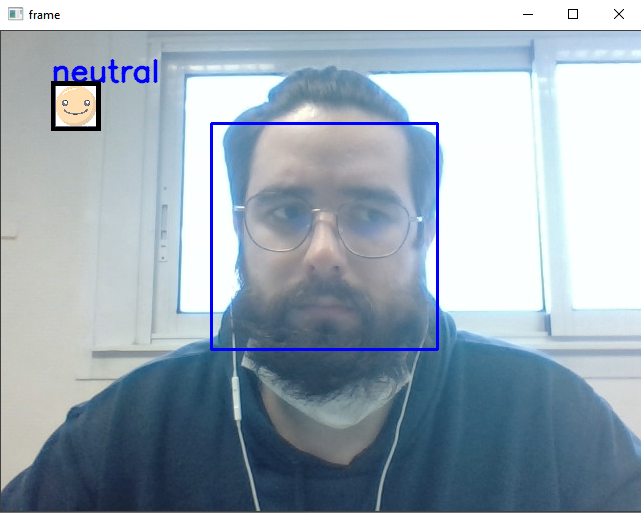

# Emotion detection

he dataset is from a kaggle competition. The maximum accuracy submitted by someone is 66 percent. It is composed by nearly 30.000 pictures representing 7 different
emotion (sad, happy, fear, disgust, neutral, surprise and angry ). The first step was to do a classifier for these emotions. 

## Emotion classifier

I have decided to import the picture in their original size and color ( 48x48 and greyscale ). Once we gathered all the picture in a array, i used a CNN to try to classify it.
The first result that i had were very poor ( approximately 30% ), so i decided to use a bigger network. 
Finally, i kept an architecture with 4 convolution layers and 3 neural layers. 

To optimize the results, i used built in function from Tensorflow that automticaly reduce the learning rate and stop the training based on the validation accuracy mesured by
the network. Then, i try a lot of combination of filter size filter number for the CNN, a lot of number of input for the dense layers, different optimizers ( RMSprop, Adam,
Adamax )
and different hyperparameter to get the best result that i can. I obtained a maximum of 66% and i'm still trying to get a better result.
 
 
## Emotion detection

To detect emotion with the camera, I used cv2 videocapture. On every frame, i extract the region were the face is, and predict the class with my model. 
Haarcascade classifier from cv2 was used to detect the faces in each frame. With the bounding box coordonates, i was able to extract the region of interest and do my prediction. 

## Conclusion

The emotion classifier is not really accurate ( 66% is not really great ) and i clearly don't know how to get a better result. I think that with more equilibrated number of picture in every class we should get a better result.
 
